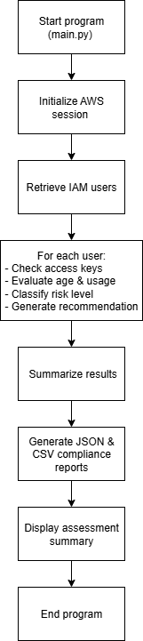
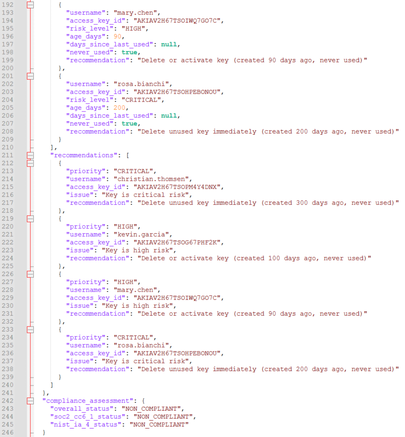
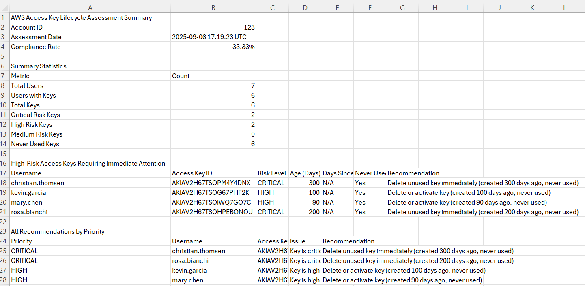

# AWS Inactive Key Rotation Checker

A Python-based compliance tool that scans IAM users across an AWS account to identify inactive, unused, or outdated access keys. The tool provides actionable recommendations and generates detailed reports in both JSON and CSV formats, making it easier to align with compliance standards like SOC 2 CC6.1 and NIST 800-53 IA-4.

---

## Key Features

- AWS IAM Integration — Connects using a specified AWS profile or default credentials.
- Access Key Analysis — Evaluates key age, last used date, and usage frequency.
- Risk Classification — Tags keys as CRITICAL, HIGH, MEDIUM, LOW, or COMPLIANT.
- Actionable Recommendations — Suggests whether to rotate, monitor, or delete keys.
- Report Generation — Outputs JSON and CSV reports with detailed summaries.
- Compliance Evaluation — Assesses overall security posture against:
  - SOC 2 (CC6.1 - Logical and Physical Access Controls)
  - NIST 800-53 (IA-4 - Identifier Management)
- Multi-region Support — Default region is us-east-1, but can be configured.

---

## Technologies Used

| Tool / Library        | Purpose                                                         |
| --------------------- | --------------------------------------------------------------- |
| `Python 3`            | Core programming language                                       |
| `boto3`               | AWS SDK for Python — used to interact with IAM and STS services |
| `argparse`            | Command-line interface for parsing CLI arguments                |
| `json`, `csv`         | Report generation and data serialization                        |
| `datetime`            | Time-based calculations for key age and last usage              |
| `botocore.exceptions` | Robust error handling for AWS SDK calls                         |
| Windsurf IDE          | Cloud-based IDE used for writing, testing, and debugging code   |

Windsurf IDE helped streamline development in the cloud, especially for interacting with AWS services.

---

## High-Level Logic Flow



---

## Environment Setup

### 1. Set up virtual environment

#### Create and activate virtual environment:
python3 -m venv venv

#### On Windows:
venv\Scripts\activate

#### On macOS/Linux:
source venv/bin/activate

#### Install dependencies:
pip install -boto3

---

### 2.  AWS Configuration

#### Configure your AWS credentials using:
aws configure sso or aws configure

<details> <summary> <strong>Required IAM Permissions</strong> (click to expand)</summary>

```json
{
    "Version": "2012-10-17",
    "Statement": [
        {
            "Effect": "Allow",
            "Action": [
                "iam:ListUsers",
                "iam:ListAccessKeys",
                "iam:GetAccessKeyLastUsed",
                "iam:GetLoginProfile"
            ],
            "Resource": "*"
        }
    ]
}
```
</details>

---

### 3. How to Run

python inactive_key_checker.py --profile your-profile-name --region us-east-1

(Refer to link in the Resources section below for full Python code for inactive_key_checker.py)

### Example code snippets

Below are three important code blocks

#### Session initialization

This function initializes a session with AWS using the provided profile and region, connects to IAM and STS services, and retrieves the AWS account ID. It handles errors like missing profiles or credentials and confirms a successful connection to AWS.

<details> <summary> View Code</summary>

```python
def initialize_aws_session(self):
    try:
        if self.profile_name:
            print(f"🔐 Initializing AWS session with profile: {self.profile_name}")
            self.session = boto3.Session(profile_name=self.profile_name, region_name=self.region)
        else:
            print("🔐 Initializing AWS session with default credentials")
            self.session = boto3.Session(region_name=self.region)
        self.iam_client = self.session.client('iam')
        sts_client = self.session.client('sts')
        caller_identity = sts_client.get_caller_identity()
        self.account_id = caller_identity['Account']
        print(f"✅ Successfully connected to AWS Account: {self.account_id}")
        return True
    except ProfileNotFound:
        print(f"❌ Error: AWS profile '{self.profile_name}' not found")
        return False
    except NoCredentialsError:
        print("❌ Error: No AWS credentials found")
        return False

```
</details>

#### Analyze access keys

This main analysis function retrieves all IAM users, evaluates each user's access keys against age and usage policies, classifies keys by risk level, and summarizes the findings including compliance percentages and risk counts.

<details> <summary> View Code</summary>

```python
def analyze_all_access_keys(self):
    print("🔍 Starting comprehensive access key analysis...")
    users = self.get_all_iam_users()
    if not users:
        print("⚠️  No IAM users found or unable to retrieve users")
        return None
    
    # Analysis logic continues... (truncated for brevity)
    
    print(f"📊 Analysis complete:")
    print(f"  - Total users: {analysis_results['summary']['total_users']}")
    print(f"  - Users with keys: {analysis_results['summary']['users_with_keys']}")
    print(f"  - Total keys: {total_keys}")
    print(f"  - Critical risk: {analysis_results['summary']['critical_keys']}")
    print(f"  - High risk: {analysis_results['summary']['high_risk_keys']}")
    print(f"  - Compliance rate: {compliance_rate}%")
    return analysis_results

```
</details>

#### Running the assessment

This function coordinates the overall assessment: it initializes the AWS session, runs the analysis, generates reports in JSON and CSV, and prints a detailed summary with compliance results and recommendations to the console.

<details> <summary> View Code</summary>

```python
def run_assessment(self):
    print("🚀 Starting AWS Access Key Lifecycle Assessment")
    print("=" * 60)
    if not self.initialize_aws_session():
        return False
    analysis_results = self.analyze_all_access_keys()
    if not analysis_results:
        print("❌ Failed to analyze access keys")
        return False
    print("\n📋 Generating compliance reports...")
    json_report = self.generate_json_report(analysis_results)
    self.save_json_report(json_report)
    self.save_csv_report(analysis_results)
    # Output summary
    print("\n" + "=" * 60)
    print("📊 ASSESSMENT SUMMARY")
    print("=" * 60)
    print(f"Account ID: {self.account_id}")
    print(f"Total Users: {analysis_results['summary']['total_users']}")
    print(f"Total Access Keys: {analysis_results['summary']['total_keys']}")
    print(f"Critical Risk Keys: {analysis_results['summary']['critical_keys']}")
    print(f"High Risk Keys: {analysis_results['summary']['high_risk_keys']}")
    print(f"Never Used Keys: {analysis_results['summary']['never_used_keys']}")
    print(f"Compliance Rate: {analysis_results['summary']['compliance_rate']}%")
    overall_status = json_report['compliance_assessment']['overall_status']
    print(f"Overall Status: {overall_status}")
    if overall_status == 'COMPLIANT':
        print("✅ Access key management meets compliance requirements!")
    else:
        print("⚠️  Access key management requires attention - see recommendations above")
    return True
```
</details>

---

### 4. Reports & Output Files

After running, you'll get three reports:

- Report output in your terminal (compliant or non-compliant report - example below)
- JSON report (non-compliant sample output below)
- CSV report (non-compliant sample output below)

<details> <summary> <strong>Sample CLI output showing non-compliance</strong> (click to expand)</summary>


</details>

<details> <summary> <strong>Sample JSON screenshot showing non-compliance</strong> (click to expand)</summary>



</details>

<details> <summary> <strong>Sample CSV screenshot showing non-compliance</strong> (click to expand)</summary>
  


</details>
---

## Design Considerations

Several design goals and considerations guided the development of this tool:
- Security Awareness First: Built around the idea that unused or outdated IAM keys are a major attack vector.
- Compliance Integration: Included mapping to SOC 2 and NIST standards to reflect real-world security needs.
- Modular and Extensible: Separated logic into methods to make future enhancements (like email alerts or Slack integration) easier.
- User-Friendly CLI Output: Focused on readable symbols (✅, ❌, ⚠️) and summaries to help users quickly understand the state of their keys.
- Beginner-Friendly Code: Used clear variable names and verbose error messages to help others understand and learn from the script.

---

## What I Learned

- AWS IAM Fundamentals: I now better understand how IAM users, access keys, and usage data work.
- Python & boto3: Learned how to use the boto3 library to interact with AWS programmatically.
- Risk & Compliance Thinking: Gained experience in interpreting security standards and building tools around them.
- Report Generation: Learned how to generate and format structured JSON and CSV reports from analysis.
- CLI App Design: Built a real-world CLI tool with argument parsing, error handling, and logging.

---

## Resources

- [Inactive Key Rotation Check](https://www.patreon.com/posts/lab-inactive-key-137806331?collection=1606822)
- [GRC Engineering](https://grcengineeringbook.com/)


