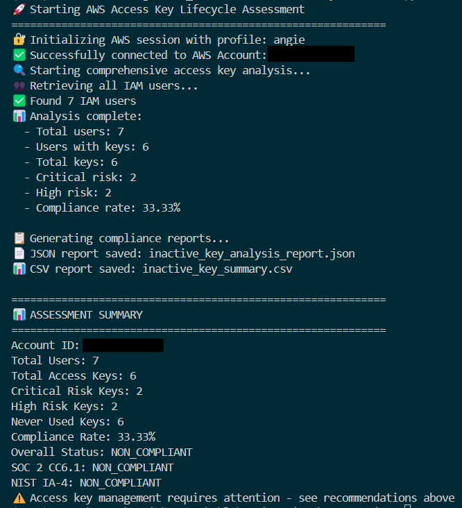

# AWS Inactive Key Rotation Checker

Automate AWS IAM access key lifecycle assessments and generate SOC 2/NIST-aligned compliance reports using Python and Boto3.

---

## About this project

This tool demonstrates how GRC engineering translates cloud security controls into automated, auditable evidence.

This project identifies inactive or outdated IAM access keys across AWS accounts and evaluates them against security and compliance standards such as SOC 2 CC6.1 and NIST 800-53 IA-4. It provides actionable remediation recommendations, compliance reports (JSON and CSV), and visual summaries for cloud governance and security teams.

> **Why this matters**:
> Unused or stale access keys are among the most common sources of credential exposure. This tool automates their detection, enabling continuous compliance and reducing manual audit overhead for GRC and security engineers.

---

## Overview

| Area                      | Description                                                                       |
| ------------------------- | --------------------------------------------------------------------------------- |
| **Purpose**               | Detect inactive or outdated IAM access keys                                       |
| **Focus**                 | Automate key lifecycle assessment, classify risk, and generate compliance reports |
| **Tech Stack**            | Python • Boto3 • argparse • JSON & CSV • AWS IAM APIs                             |
| **Key Outcome**           | JSON and CSV compliance reports with detailed risk classifications                |
| **Compliance Frameworks** | SOC 2 CC6.1, NIST 800-53 IA-4                                                     |
| **Target Users**          | Security, compliance, and GRC engineering teams                                   |

---

## Architecture & Logic Flow


---

## How it works

1. Initializes a secure AWS session using boto3 with your chosen profile and region.
2. Scans all IAM users and retrieves access key metadata (creation date, last used date).
3. Analyzes key activity to determine whether keys are active, stale, or unused.
4. Classifies keys by risk level - CRITICAL, HIGH, MEDIUM, LOW, or COMPLIANT.
5. Generates compliance scores and JSON/CSV reports with actionable recommendations.
6. Displays a readable CLI summary highlighting non-compliant keys.

All analysis is automated and can be extended into CI/CD compliance checks or AWS Config rules.

---

## Quick Start

### 1. Set up your Python virtual environment

```bash
python3 -m venv venv            # Create and activate virtual environment
source venv/bin/activate        # macOS/Linux
venv\Scripts\activate           # Windows
pip install boto3               # Install dependencies
```

---

### 2. Configure AWS credentials

```bash
aws configure sso
# or
aws configure
```

<details> <summary> <strong>Required IAM Permissions</strong> (click to expand)</summary>

```json
{
    "Version": "2012-10-17",
    "Statement": [
        {
            "Effect": "Allow",
            "Action": [
                "iam:ListUsers",
                "iam:ListAccessKeys",
                "iam:GetAccessKeyLastUsed",
                "iam:GetLoginProfile"
            ],
            "Resource": "*"
        }
    ]
}
```
</details>

---

### 3. Run the tool

```bash
python inactive_key_checker.py --profile your-profile-name --region us-east-1
```

(Refer to link in the [Resources](#resources) section below for full Python script)

---

## Core Components

| Component                      | Description                                                                 |
| ------------------------------ | --------------------------------------------------------------------------- |
| **KeyRotationChecker**         | Initializes AWS session and coordinates the IAM scan and compliance logic   |
| **analyze_all_access_keys()**  | Evaluates each IAM user’s access keys for age, usage, and compliance status |
| **Risk Classification Engine** | Assigns risk levels (Critical–Compliant) based on thresholds and usage      |
| **Reporting Module**           | Outputs structured JSON/CSV reports for automation and audit use            |
| **CLI Interface**              | Provides human-readable summaries and color-coded risk visualization        |

---
### Example code snippets
*Note: Refer to the [Resources](#resources) section below for the full Python script.*

#### 1. Session initialization

Establishes a secure AWS session and retrieves the account ID.

<details> <summary> View Code</summary>

```python
def initialize_aws_session(self):
    try:
        if self.profile_name:
            print(f"🔐 Initializing AWS session with profile: {self.profile_name}")
            self.session = boto3.Session(profile_name=self.profile_name, region_name=self.region)
        else:
            print("🔐 Initializing AWS session with default credentials")
            self.session = boto3.Session(region_name=self.region)
        self.iam_client = self.session.client('iam')
        sts_client = self.session.client('sts')
        caller_identity = sts_client.get_caller_identity()
        self.account_id = caller_identity['Account']
        print(f"✅ Successfully connected to AWS Account: {self.account_id}")
        return True
    except ProfileNotFound:
        print(f"❌ Error: AWS profile '{self.profile_name}' not found")
        return False
    except NoCredentialsError:
        print("❌ Error: No AWS credentials found")
        return False

```
</details>

#### 2. Access Key Analysis

Evaluates each IAM user's keys for compliance.

<details> <summary> View Code</summary>

```python
def analyze_all_access_keys(self):
    print("🔍 Starting comprehensive access key analysis...")
    users = self.get_all_iam_users()
    if not users:
        print("⚠️  No IAM users found or unable to retrieve users")
        return None
    
    # Analysis logic continues... (truncated for brevity)
    
    print(f"📊 Analysis complete:")
    print(f"  - Total users: {analysis_results['summary']['total_users']}")
    print(f"  - Users with keys: {analysis_results['summary']['users_with_keys']}")
    print(f"  - Total keys: {total_keys}")
    print(f"  - Critical risk: {analysis_results['summary']['critical_keys']}")
    print(f"  - High risk: {analysis_results['summary']['high_risk_keys']}")
    print(f"  - Compliance rate: {compliance_rate}%")
    return analysis_results

```
</details>

#### 3. Assessment Orchestration

Coordinates initialization, analysis, and reporting.

<details> <summary> View Code</summary>

```python
def run_assessment(self):
    print("🚀 Starting AWS Access Key Lifecycle Assessment")
    print("=" * 60)
    if not self.initialize_aws_session():
        return False
    analysis_results = self.analyze_all_access_keys()
    if not analysis_results:
        print("❌ Failed to analyze access keys")
        return False
    print("\n📋 Generating compliance reports...")
    json_report = self.generate_json_report(analysis_results)
    self.save_json_report(json_report)
    self.save_csv_report(analysis_results)
    # Output summary
    print("\n" + "=" * 60)
    print("📊 ASSESSMENT SUMMARY")
    print("=" * 60)
    print(f"Account ID: {self.account_id}")
    print(f"Total Users: {analysis_results['summary']['total_users']}")
    print(f"Total Access Keys: {analysis_results['summary']['total_keys']}")
    print(f"Critical Risk Keys: {analysis_results['summary']['critical_keys']}")
    print(f"High Risk Keys: {analysis_results['summary']['high_risk_keys']}")
    print(f"Never Used Keys: {analysis_results['summary']['never_used_keys']}")
    print(f"Compliance Rate: {analysis_results['summary']['compliance_rate']}%")
    overall_status = json_report['compliance_assessment']['overall_status']
    print(f"Overall Status: {overall_status}")
    if overall_status == 'COMPLIANT':
        print("✅ Access key management meets compliance requirements!")
    else:
        print("⚠️  Access key management requires attention - see recommendations above")
    return True
```
</details>

---

### 4. Reporting & Evidence Outputs

These reports serve as audit evidence for IAM key rotation control validation.

After execution, three report types are generated:

1. Report output in your terminal (compliant or non-compliant report - example below)
2. JSON report (non-compliant sample output below)
3. CSV report (non-compliant sample output below)

**1. Sample CLI output showing non-compliance**



**2. Sample JSON screenshot showing non-compliance**


**3. Sample CSV screenshot showing non-compliance**
  


---

## Compliance Context

| Framework            | Relevant Domains        | Description                                                           |
| -------------------- | ----------------------- | --------------------------------------------------------------------- |
| **SOC 2 CC6.1**      | Logical Access Controls | Validates that logical access mechanisms enforce credential rotation  |
| **NIST 800-53 IA-4** | Identifier Management   | Ensures identifiers and credentials are periodically reviewed/rotated |

---

## Use Cases

- Integrate into CI/CD pipelines to enforce continuous IAM key rotation compliance
- Generate SOC 2 and NIST evidence automatically for audit readiness
- Extend AWS Config or Security Hub workflows with key lifecycle analytics

---

## Governance & Security

- Enforces least-privilege IAM permissions for operation.
- Generates audit-ready compliance reports for SOC/NIST frameworks.
- Integrates easily into GRC automation workflows or CI/CD pipelines.
- CLI workflow supports repeatability and reduces manual error.

---

## What I Learned

- Automated IAM credential lifecycle reviews using Python and AWS APIs.
- Mapped NIST and SOC 2 controls directly into code logic.
- Designed audit-ready compliance reports for GRC teams.
- Strengthened AWS automation and governance-by-code principles.

---

## Resources

- [Inactive Key Rotation Check](https://www.patreon.com/posts/lab-inactive-key-137806331?collection=1606822)
- [GRC Engineering](https://grcengineeringbook.com/)

---


